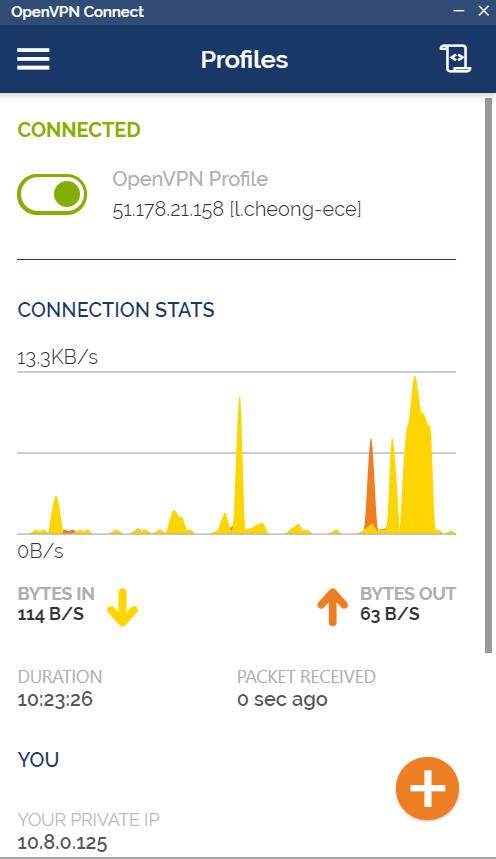
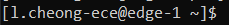
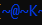
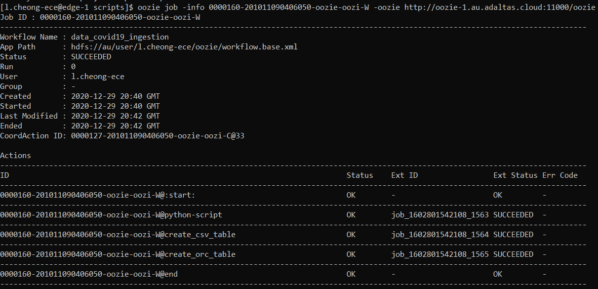
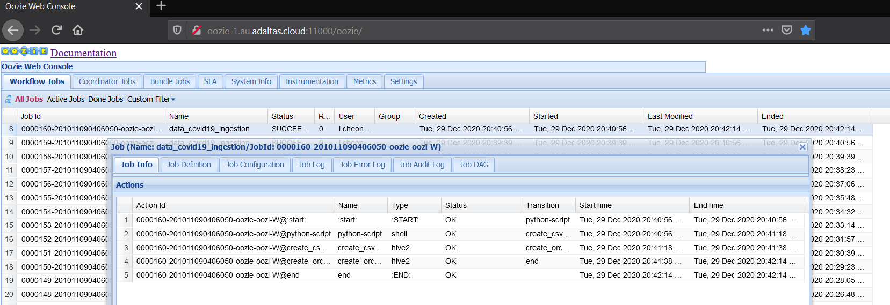

# A propos
Ceci est un projet scolaire d'ECE Paris en Big Data Ecosystem. 
Ce projet fait de l'auto-ingestion de données csv du Covid19 grâce à Oozie.
Il existe déjà un job qui s'exécute qui met à jour les données de 2020-12-29 à 18h au 2021-02-15 à 21h

Auteurs:
- BRUNO Charlène (charlene.bruno@edu.ece.fr)
- CHEONG Loïc (loic.cheong@edu.ece.fr)

Professeur:
LEONARD Gauthier

ECE Paris 2020/2021
ING5 BDA Gr02

# Comment exécuter le code ?
Activer *OpenVPN Connect* pour pouvoir vous connecter à votre session sur l'invite de commandes, PowerShell ou le terminal.

  

Une fois votre session ouverte  
- cloner le projet localement : `git clone https://github.com/CheongLoic/Big_Data_project.git`
- Créer un fichier *projetBigData* en hdfs: `hdfs dfs -mkdir <hdfs_path>` (exemple: `hdfs dfs -mkdir /education/ece/big-data/2020/fall/bda/gr2/gauthier/projetBigData` )

## Apporter les modifications necessaires
Modifier les fichiers avec la commande `vim <nom_du_fichier>`

**Note: Le professeur n'a pas besoin de faire cet étape ! Le code soumis a été écrit de tel façon qu'il face le moins de travail possible**

1. Dans le fichier **oozie**
- `cd Big_Data_project/oozie`
- coodinator.xml : remplacer le chemin hdfs du *workflow.base.xml* dans `<app-path> workflow_hdfs_path </app-path>`
- job.properties : remplacer les variables *username* et *oozie.coord.application.path*

2. Dans le fichier **oozie/scripts**
- `cd Big_Data_project/oozie/scripts` ou `cd scripts`
- projet.py: changer *hdfs_path*
- create_ext_table_covid.hql: remplacer la variable *username* et supprimer les  
- create_orc_table_covid.hql: remplacer la variable *username* et supprimer les  

## Lancer Oozie
- `hdfs dfs -put -f oozie/ "/user/<username>"`  (exemple: `hdfs dfs -put -f oozie/ "/user/gauthier"`)
- `oozie job -run -config oozie/job.properties -oozie http://oozie-1.au.adaltas.cloud:11000/oozie`

## Vérification
1. En CLI

Pour vérifier le status du job, copier le job_ID, puis exécuter `oozie job -info <job_ID> -oozie http://oozie-1.au.adaltas.cloud:11000/oozie`

  

Pour arrêter un coordination job: `oozie job -oozie http://oozie-1.au.adaltas.cloud:11000/oozie -kill <Coord_job_ID>`

2. Oozie Web Console

Pour cela, télécharger Kerbereos et générer un ticket en suivant les étapes dans ce lien https://www.adaltas.com/en/2019/11/04/windows-krb5-client-spnego/

Ouvrir http://oozie-1.au.adaltas.cloud:11000/oozie sur Firefox

  

# Visualiser les données
## Zeppelin
Aller sur http://zep-1.au.adaltas.cloud:9995/#/notebook/2FWHFDFTV
